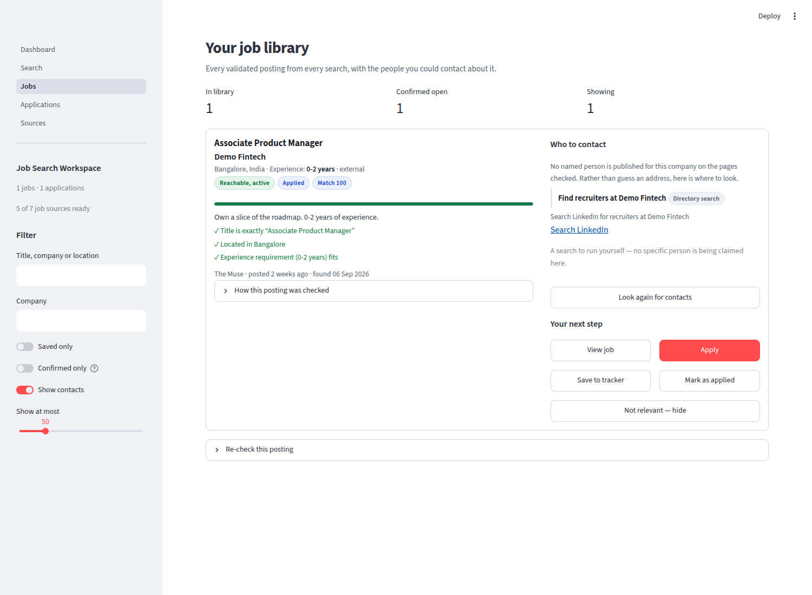
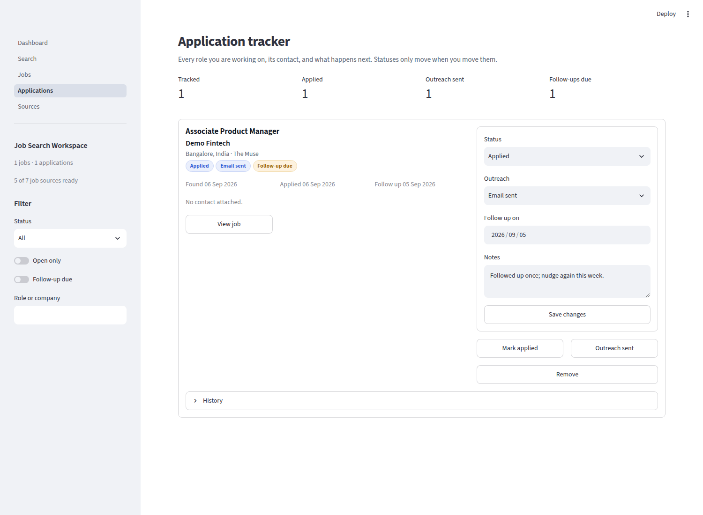
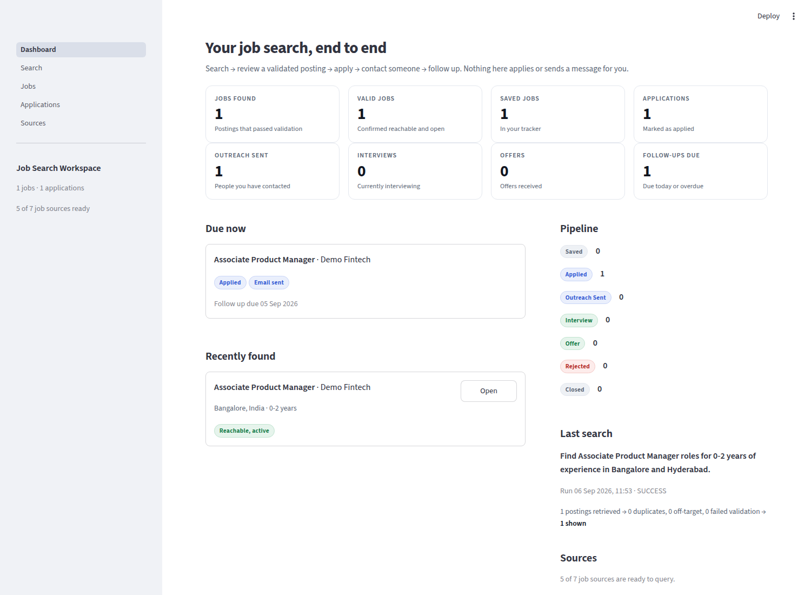
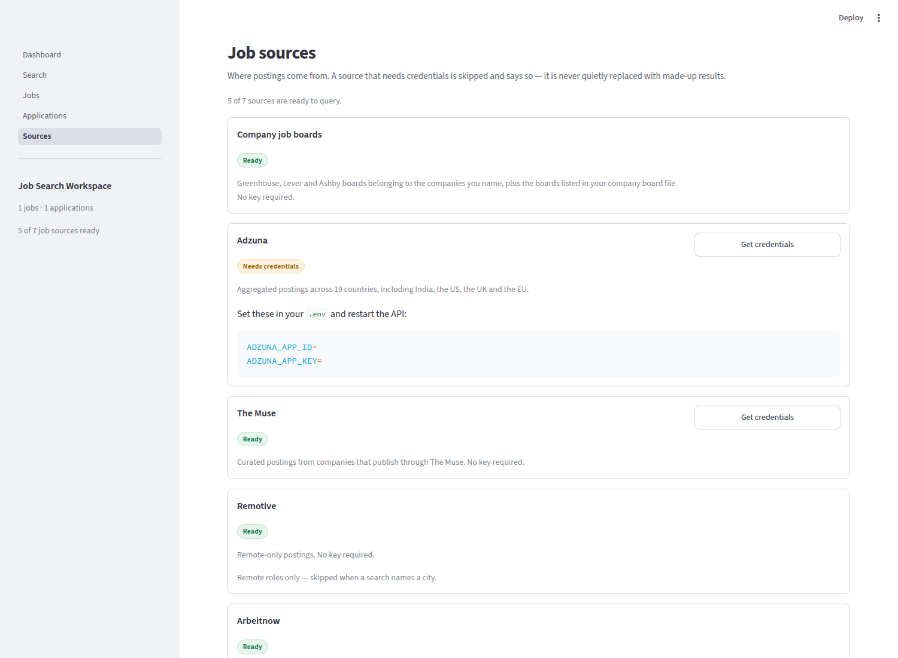

# Job Search & Outreach Workspace

Describe the roles you want in plain English. The workspace searches public job
APIs and companies' own job boards for **real, currently open postings**, checks
each one before showing it, finds publicly published people at those companies
who could be contacted about the role, and tracks every application you make.

```
Search  →  Review a validated posting  →  Open it  →  Apply  →  Contact someone  →  Track
```

> **“Find Associate Product Manager roles for 0–2 years of experience in
> Bangalore and Hyderabad.”**
>
> → Adzuna, The Muse and matching Greenhouse/Lever/Ashby boards are queried
> → duplicates collapsed, off-target roles dropped
> → each survivor fetched and checked: link works, company matches, role still open
> → contacts found from the company's own pages
> → the ones that pass are shown, each with its verdict and who to contact.

## What it will not do

These are product decisions, enforced in code and covered by tests:

| It will never | Because |
|---|---|
| Invent a job, company, person, email or URL | Every record traces to a provider response or a page URL it cites |
| Guess an email from a name and a domain | Verifying that a domain accepts mail says nothing about whether the mailbox is that person's. There is no `INFERRED` value in `EmailStatus` at all |
| Show a posting it has not checked | Validation runs before display; anything unchecked is withheld, not shown with a shrug |
| Claim a check passed that did not | "Could not confirm" is a first-class outcome with its own badge, distinct from "verified active" |
| Read anything behind a login | LinkedIn member data included. Where a person cannot be found publicly, you get a **search link** you run yourself |
| Work around a site that declines access | A 403 or a robots.txt disallow is a terminal, logged outcome — never a retry in disguise |
| Apply or send a message for you | It opens the employer's page and puts an address on your clipboard. You decide the rest |

## Quick start

```bash
python -m venv .venv && source .venv/bin/activate
pip install -r requirements.txt
cp .env.example .env                 # every integration in it is optional

createdb roi                         # PostgreSQL 14+
alembic upgrade head

uvicorn app.main:app --reload        # API   → http://localhost:8000/docs
streamlit run frontend/Dashboard.py  # UI    → http://localhost:8501
```

No API key is needed to start. The Muse, Remotive, Arbeitnow, Jobicy and
companies' own job boards all work unauthenticated; the **Sources** page shows
what is ready and what a key would add.

## Screens

| | |
|---|---|
| **Jobs** — a posting, its verdict, its contacts and your next step on one card | **Applications** — the tracker |
|  |  |
| **Dashboard** — where everything stands | **Sources** — what is wired up |
|  |  |

## Job sources

| Source | Coverage | Credentials |
|---|---|---|
| **Company job boards** | Greenhouse, Lever and Ashby boards belonging to companies you name | None |
| **Adzuna** | Aggregated postings across 19 countries, India included | Free — [developer.adzuna.com](https://developer.adzuna.com/signup) |
| **The Muse** | Curated employer postings | Optional key raises the rate limit |
| **Remotive** | Remote-only postings | None |
| **Arbeitnow** | European and remote postings | None |
| **Jobicy** | Remote-only postings, by region | None |
| **USAJobs** | US federal government postings | Free — [developer.usajobs.gov](https://developer.usajobs.gov/apirequest/) |

Company job boards are the best of these: they are the employer's own live
listings, so a posting that comes back is one the company is advertising right
now. Board identifiers are never assumed — a slug is derived from the company
name, probed against the real API, and used only once the endpoint answers.
A wrong guess produces *“No public board found for X”*, never a fabricated board.

For searches that name no company, the boards in
[`app/data/company_boards.json`](app/data/company_boards.json) are used. That
file is a starting point meant to be edited, and every entry in it is still
probed live before use.

## How a search works

1. **Read the request.** A rule-based parser extracts role, experience range,
   locations, companies, industries, skills and exclusions. It needs no API key.
   When one is configured, a model may *fill gaps the rules left* — it can never
   overwrite a value the rules took from an explicit phrase, and a location it
   suggests is accepted only if the gazetteer recognises it.
2. **Query every usable source.** A source that needs credentials is skipped
   *with its reason recorded on the run*, never quietly replaced.
3. **Collapse duplicates.** By canonical URL and by a fingerprint of
   (company, sorted title tokens, canonical city) — so the same role on three
   boards is one row, and the employer's own copy wins.
4. **Score against the request.** Title, location, experience, keywords,
   company and industry. Constraints you stated outright are **hard gates**: a
   perfect title cannot carry a posting past the wrong city or an experience
   requirement you ruled out. "Unknown" never trips a gate — only a stated value
   that contradicts you.
5. **Validate the survivors.** Each is fetched and put through three recorded
   checks: the URL works, the page belongs to the stated company, the role is
   still open. Validation runs *after* scoring so the request budget is spent on
   postings you might actually want.
6. **Find contacts** for each company, once, cached across searches.
7. **Persist**, with every dropped posting counted and explained.

### Validation outcomes

| Outcome | Shown? | Meaning |
|---|---|---|
| **Verified active** | Yes | Fetched, company confirmed, role confirmed open |
| **Reachable, active** | Yes | Page loads and looks live; one check inconclusive |
| **Could not confirm** | Yes, labelled | The site declined the check. This says nothing about the job — open the link yourself |
| Closed or expired | No | The page says so, or its own `validThrough` date has passed |
| Link does not work | No | 404 or 410 |
| Belongs to another company | No | The page's structured data names a different employer |

## Contacts

For each validated job, in the order they are trusted:

1. **The posting itself** — a named contact or published application address.
2. **The company's own pages** — careers, team and about pages, read for people
   with hiring-related titles, with their published addresses.
3. **A published team inbox** (`careers@`, `talent@`) — recorded as an inbox,
   never given a person's name.
4. **A directory search link** — a LinkedIn people-search URL you run in your
   own session. It names nobody and asserts nothing, which is exactly why it is
   safe to offer when a company publishes no one.

Every contact carries the URL it was read from. Personal mailboxes (gmail,
outlook) are never collected, even when published. An address on a domain that
is not the company's is rejected.

When nothing is found, the app says so plainly rather than filling the gap.

## The tracker

`Saved → Applied → Outreach Sent → Interview → Rejected → Offer → Closed`,
with a separate outreach state (`Not started / Email sent / LinkedIn sent /
Replied / No response`), notes and a follow-up date.

Statuses move only when you move them. Each application **snapshots** the job
and contact when it is created, so the row keeps working after the posting comes
down — which is exactly when a tracker matters most.

## Layout

```
app/
  search/         gazetteer, experience parsing, JobQuery, NL parser, relevance
  providers/      one module per job source, plus the registry
  services/       discovery pipeline · validation · contacts · applications
  models/         User · Company · JobSearch/SearchRun · Job · Contact · Application
  api/routes/     search · jobs · contacts · applications · dashboard · system
  security/       SSRF guard · robots.txt · rate limiting
  collectors/     the single guarded HTTP client everything fetches through
frontend/         Streamlit: Dashboard · Search · Jobs · Applications · Sources
```

The API is the whole product surface; the Streamlit UI is one client of it, so a
different frontend can be swapped in without touching the backend.

## Configuration

Everything is environment-driven; see [`.env.example`](.env.example). Useful knobs:

| Setting | Default | What it does |
|---|---|---|
| `SEARCH_MIN_RELEVANCE` | `35` | Below this, a posting is dropped as off-target |
| `SEARCH_RESULT_LIMIT` | `40` | Postings kept per search |
| `VALIDATION_MAX_JOBS` | `40` | Hard cap on live validation fetches per search |
| `CONTACTS_MAX_COMPANIES` | `10` | Companies contact discovery will crawl per search |
| `CONTACTS_CACHE_HOURS` | `168` | Do not re-crawl a company's pages this often |
| `CRAWLER_RESPECT_ROBOTS` | `true` | Leave it on. Turning it off is your responsibility |
| `API_KEY` | empty | Set it and every `/api` route requires `X-API-Key` |

## Testing

```bash
pytest                    # 236 tests
ruff check . && mypy app
```

The suite is fully offline — a local mock server stands in for every job source
and career site, so provider parsing, validation outcomes, contact provenance
and the whole API workflow are exercised without a single real request.

## Documentation

- [Architecture](docs/architecture.md) — the pipeline, module by module
- [Data model](docs/data-model.md) — tables, keys and why the tracker snapshots
- [Sources](docs/sources.md) — every provider, its payload shape and its limits
- [Security](docs/security.md) — SSRF, robots, rate limiting, secrets
- [Development](docs/development.md) — setup, migrations, adding a source
