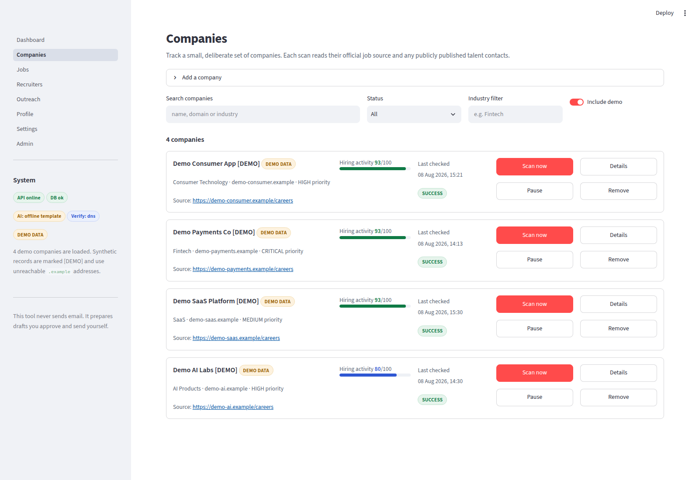
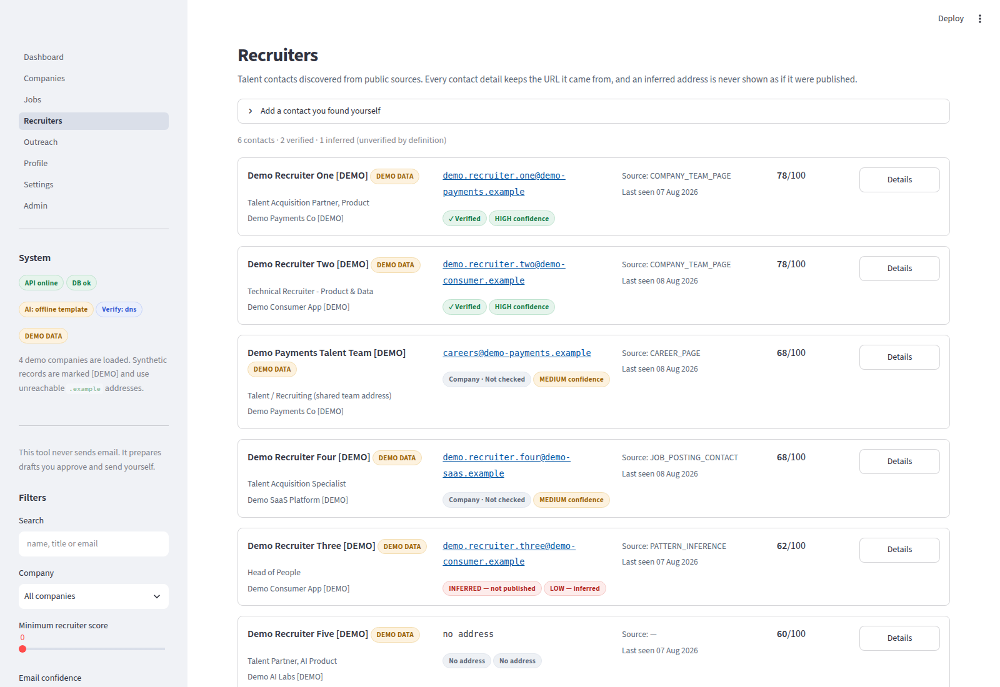
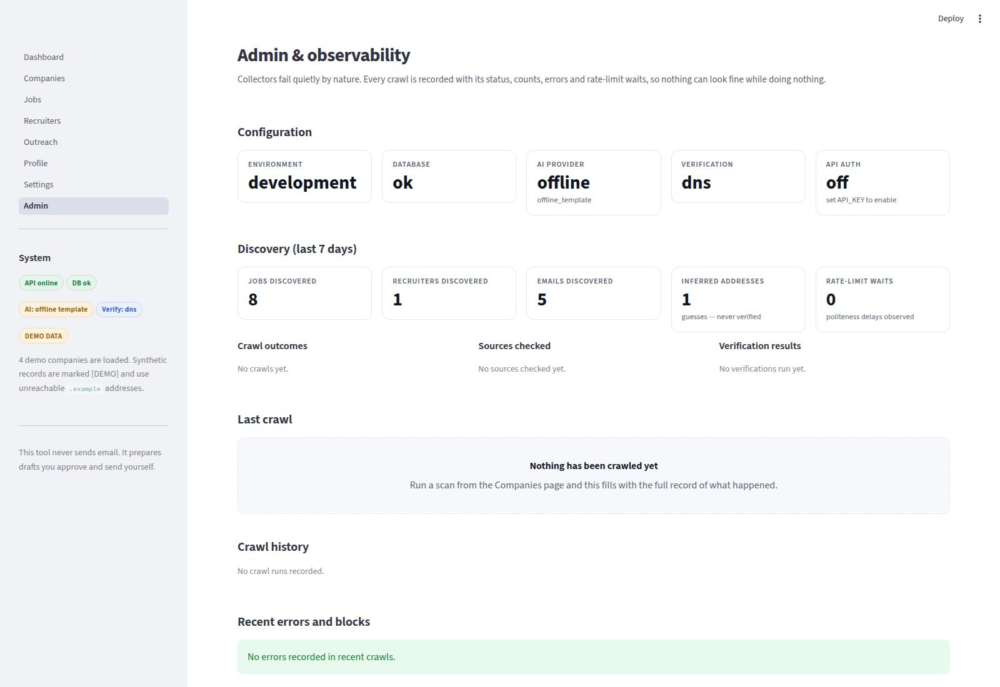

# Recruiter Outreach Intelligence

A research and outreach intelligence tool that answers one question well:

> **Who should I contact today about a role that is actively hiring?**

It follows a single chain end to end:

```
Company → Hiring signal → Relevant job → Relevant recruiter
        → Public professional contact → Verification
        → Outreach priority → Personalised draft → Your approval
```

This is **not** a mass-emailing platform. It never sends email. It prepares a
short, specific draft that you read, edit, approve, and send yourself from your
own mail client — then you record that you sent it, so the same person is never
contacted twice about the same role.

---

## What it optimises for

| Not this | This |
| --- | --- |
| How many recruiter emails can I collect? | How accurately can I identify the right person to contact, about a relevant role, at the right time? |
| A massive database | A fresh hiring signal |
| A guessed address | A verified, publicly published professional contact |
| Automated bulk sending | Explicit human approval, one lead at a time |
| A mysterious AI score | An explainable score, with every reason shown |

---

## Screenshots

| | |
| --- | --- |
|  |  |
| **Dashboard** — the ranked "contact today" shortlist | **Companies** — tracking, scanning, hiring activity |
|  |  |
| **Recruiters** — contacts with full provenance | **Admin** — every crawl, error and rate-limit wait |

Also included: [Jobs](docs/screenshots/jobs.png),
[Outreach](docs/screenshots/outreach.png),
[Profile](docs/screenshots/profile.png),
[Settings](docs/screenshots/settings.png).

---

## Responsible data collection policy

This is the part of the design that is not negotiable.

**The tool only reads information that is publicly accessible or served by an
official, documented API.** Concretely:

* Jobs come from **official public ATS APIs** (Greenhouse, Lever, Ashby job
  board endpoints, which exist so anyone can render a company's open roles) and
  from **`schema.org/JobPosting` structured data** that companies publish on
  their own career pages for exactly this purpose.
* Recruiter contacts come only from pages a company published: `mailto:` links,
  JSON-LD `Person` entries, and visible text on careers/team pages.
* Every stored contact detail keeps its **source URL and source type**, so you
  can always see where a piece of information came from.

**The tool refuses to do any of the following, and there is no flag to turn them
on:** CAPTCHA solving, login or session scraping, paywall bypass, anti-bot
evasion, scraping private profiles or messages, credential harvesting, rate-limit
evasion, proxy rotation for block circumvention, stealth/undetectable scraping,
collecting personal mailbox addresses, automated bulk unsolicited email, or
scraping LinkedIn behind authentication.

**When a site says no, we stop.** A `401`, `403`, `429` or a `Disallow` in
`robots.txt` ends the fetch, is logged, and is surfaced on the Admin page as a
`BLOCKED` crawl. It is never retried in disguise.

What the crawler does instead:

* honours `robots.txt`, including `Crawl-delay`;
* identifies itself with a real, configurable User-Agent;
* waits a configurable delay between requests to the same domain;
* enforces request timeouts, a retry budget with exponential backoff (transient
  failures only), a page budget per run, and a response size cap;
* validates every URL against SSRF before fetching, and re-validates every
  redirect hop;
* records every run — including the ones that found nothing — in `crawl_runs`.

### Inferred addresses are never "found" addresses

Pattern-based email inference exists, is **opt-in per scan**, and produces
records that are permanently labelled:

* confidence is fixed at `LOW`, source type `PATTERN_INFERENCE`, no source URL;
* `email_verified` can never become true for them, even after a check succeeds;
* the UI renders them as **"INFERRED — not published"** in a distinct colour
  everywhere they appear.

A domain accepting mail tells you nothing about whether you guessed the right
person's mailbox, and the product says so rather than implying otherwise.

---

## Architecture

```
app/
├── main.py                  FastAPI app: middleware, error handling, routers
├── config.py                Settings from the environment; every integration optional
├── api/
│   ├── deps.py              DB session, API-key auth, current user
│   └── routes/              companies · jobs · recruiters · outreach · dashboard
│                            · settings · admin
├── models/                  SQLAlchemy models (16 tables)
├── schemas/                 Pydantic request/response models + validation
├── services/
│   ├── scan.py              The orchestrator: collect → ingest → score → link
│   ├── scoring/             job_relevance · hiring_activity · recruiter_relevance
│   │                        · outreach_priority · weights · context
│   ├── jobs/                ingest + cross-source duplicate detection
│   ├── recruiters/          ingest · linking · pattern inference
│   ├── email/               verifier providers + persistence
│   ├── ai/                  LLM provider abstraction + email generation
│   ├── outreach/            state machine, approval gate, duplicate prevention
│   └── crawl_tracking.py    crawl run lifecycle and source records
├── collectors/
│   ├── http_client.py       the single guarded fetcher (SSRF · robots · limits)
│   ├── base.py              BaseCollector: collect/normalize/deduplicate/validate
│   ├── job_sources/         Greenhouse · Lever · Ashby public APIs
│   ├── career_pages/        JSON-LD first, link discovery second
│   └── public_sources/      published talent contacts
├── security/                url_guard (SSRF) · rate_limit · robots
├── db/                      base · session · demo seed
├── workers/                 APScheduler background scans
└── utils/                   text normalisation · dates · HTML
frontend/                    Streamlit UI (a pure API client)
tests/                       unit · integration · security (257 tests)
docs/                        architecture · data-model · collectors · scoring
                             · security · development
```

The Streamlit frontend talks to the backend **only over HTTP**, so replacing it
with React/Next.js means pointing a new client at the same API.

Full detail: [docs/architecture.md](docs/architecture.md).

---

## Setup

### Requirements

* Python 3.11+
* PostgreSQL 14+

### Install

```bash
git clone <this repository>
cd Recruiter_info

python3 -m venv .venv
source .venv/bin/activate
pip install -r requirements.txt
```

### Database

```bash
createuser roi --pwprompt          # or use an existing role
createdb -O roi roi
createdb -O roi roi_test           # for the test suite
```

### Configure

```bash
cp .env.example .env
$EDITOR .env                       # set DATABASE_URL at minimum
```

**Every third-party integration is optional.** With no API keys at all, the app
starts and the entire workflow runs: email verification falls back to local
DNS/MX checks, and email drafting falls back to a deterministic offline
template.

| Variable | Required | Purpose |
| --- | --- | --- |
| `DATABASE_URL` | **yes** | PostgreSQL connection string |
| `OWNER_EMAIL` | no | Identifies the single local user (default `owner@localhost`) |
| `API_KEY` | no | When set, every `/api` request needs `X-API-Key`. Empty = local no-auth |
| `OPENROUTER_API_KEY` | no | Enables LLM drafting. Empty → offline template drafter |
| `OPENROUTER_BASE_URL` | no | Any OpenAI-compatible endpoint (default OpenRouter) |
| `OPENROUTER_MODEL` | no | Model id, e.g. `anthropic/claude-3.5-sonnet` |
| `EMAIL_VERIFICATION_PROVIDER` | no | `dns` (default, local) · `null` · `http` |
| `EMAIL_VERIFICATION_API_KEY` / `_API_URL` | no | For the `http` provider |
| `CRAWLER_USER_AGENT` | no | Identify yourself honestly; include a contact URL |
| `CRAWLER_DOMAIN_DELAY_SECONDS` | no | Politeness delay per domain (default 2.0) |
| `CRAWLER_MAX_PAGES_PER_RUN` | no | Hard crawl budget (default 25) |
| `CRAWLER_RESPECT_ROBOTS` | no | Leave `true` |
| `CRAWLER_ALLOW_PRIVATE_NETWORKS` | no | **Must stay `false`** outside tests (SSRF) |
| `SCHEDULER_ENABLED` | no | Background scans via APScheduler |
| `API_RATE_LIMIT_PER_MINUTE` | no | Protects this app's own API |

### Migrations

```bash
alembic upgrade head           # apply
alembic check                  # confirm models and migrations agree
alembic revision --autogenerate -m "describe the change"
```

### Run

Two processes:

```bash
# Terminal 1 — API on :8000
uvicorn app.main:app --reload

# Terminal 2 — UI on :8501
streamlit run frontend/Dashboard.py
```

Then open <http://localhost:8501>. API docs are at <http://localhost:8000/docs>.

### Demo mode

```bash
python scripts/seed_demo.py            # load synthetic data
python scripts/seed_demo.py --reset    # rebuild it
python scripts/seed_demo.py --clear    # remove it (real data untouched)
```

Demo records are flagged `is_demo`, carry a **`[DEMO]`** marker in their names,
and every address uses the RFC 2606 reserved `.example` TLD, which cannot
resolve and cannot deliver mail. There is no path by which demo data can cause
an email to reach a real person.

> Because `.example` domains genuinely do not exist, clicking **Verify** on a
> demo contact correctly reports `invalid`. That is the verifier being honest,
> not a bug.

---

## Using it

1. **Add a company** (Companies page). A Greenhouse/Lever/Ashby board URL gives
   the best results because those are official APIs; otherwise use the company's
   own careers page.
2. **Run a scan.** Jobs are discovered, deduplicated, and scored; publicly
   published talent contacts are collected with their sources; hiring signals
   and the company's hiring activity score are recomputed.
3. **Read the dashboard.** The "contact today" list ranks (job, recruiter) pairs
   by outreach priority. Open any row to see every reason behind the number.
4. **Verify an address** on the Recruiters page before relying on it.
5. **Add a lead** to the outreach queue.
6. **Generate a draft**, edit it until it sounds like you, then **approve** it.
   Editing an approved draft revokes approval — you always approve exactly what
   you send.
7. **Send it yourself**, then click *"I sent this — record it"*. That pair
   disappears from recommendations and cannot be contacted again by accident.
8. **Mark anyone `DO NOT CONTACT`** at any time. They are removed from
   recommendations, their leads are retired, and new leads for them are refused.

---

## Testing

```bash
pytest                       # the whole suite
pytest tests/unit            # fast, no database needed for most
pytest tests/security -v     # SSRF, injection, auth, secrets
pytest -m integration        # database + collector flows
```

**257 tests**, split into:

* **unit** — normalisation, duplicate detection, all four scoring engines,
  outreach state transitions, verification providers, AI drafting guardrails;
* **integration** — collectors against a local mock site, the database ingest
  and dedupe flow, crawl-run tracking, demo-data safety, migration parity, and
  the complete API workflow;
* **security** — 25+ SSRF payloads, SQL injection across every search and filter,
  input validation, API-key auth, and secret-leakage checks.

The suite is **fully offline**: no test contacts a real website. External sites
are stood in for by `tests/fixtures/mock_server.py`, which serves canned ATS
JSON, a JSON-LD career page, a team page, plus `robots.txt`, 403 and redirect
endpoints.

Quality gates:

```bash
ruff check app/ tests/ scripts/ frontend/
mypy app/
```

---

## Supported sources

| Source | Access method | Notes |
| --- | --- | --- |
| Greenhouse | `boards-api.greenhouse.io` public board API | Official, unauthenticated, authoritative |
| Lever | `api.lever.co/v0/postings` public API | Official, unauthenticated, authoritative |
| Ashby | `api.ashbyhq.com/posting-api/job-board` | Official, unauthenticated, authoritative |
| Company career pages | `schema.org/JobPosting` JSON-LD | Preferred; published for aggregators |
| Company career pages | Job-detail link discovery | Fallback, budget-limited |
| Careers / team pages | `mailto:` links, JSON-LD `Person`, visible text | Recruiter contacts, with provenance |
| Pattern inference | Derived from an address the company published | Opt-in, always `LOW`, never verified |

"Authoritative" means the source lists *all* current openings, so a job that
disappears can safely be marked `CLOSED`. Partial sources never close jobs.

---

## Limitations

* **Client-side career pages.** If a company renders its listings purely in
  JavaScript and publishes no structured data, nothing is discovered. The scan
  says so explicitly and suggests using the ATS board URL. We do not run a
  headless browser to work around a site's choices.
* **Most companies do not publish recruiter addresses.** Empty recruiter results
  are the normal case, not a failure. The alternative — guessing — is exactly
  what this tool refuses to present as fact.
* **LinkedIn is out of scope entirely.** No authenticated scraping, no member
  data. You can store a public profile URL you found yourself.
* **DNS verification cannot confirm a mailbox.** It proves a domain accepts mail
  and that syntax is valid. It reports `risky` for shared role addresses rather
  than overclaiming `valid`.
* **Single user.** One owner per installation; there is a `users` table and
  every query is scoped by user, but there is no multi-tenant auth.
* **In-process rate limiting.** Politeness state is per-process, which is
  correct for a single-user tool and would need shared state if it were ever
  scaled out.
* **Restricted networks.** In a sandbox that allowlists outbound hosts, live ATS
  endpoints are unreachable and scans are recorded as `BLOCKED` — visible on the
  Admin page rather than failing silently.

---

## Security

* Secrets come from the environment only; `.env` is git-ignored and
  `.env.example` ships with empty placeholders (a test asserts this).
* **SSRF protection** on every outbound URL: scheme allowlist, no embedded
  credentials, blocked internal hostnames, port allowlist, and DNS resolution
  with rejection of loopback/private/link-local/CGNAT/metadata addresses.
  Redirect hops are re-validated individually.
* SQL injection is structurally prevented by SQLAlchemy parameterisation, and
  covered by tests that fire injection payloads at every search and filter.
* Input and output validation via Pydantic on every route.
* Optional API-key auth with constant-time comparison; per-client rate limiting.
* Errors return safe messages with a request id; internals, stack traces and the
  database URL never reach a response body.
* Structured logging via `structlog`, with a request id bound to every log line.
* Security headers: `X-Content-Type-Options`, `X-Frame-Options`,
  `Referrer-Policy`.

More detail: [docs/security.md](docs/security.md).

---

## Roadmap

* Additional official job sources (Workday, SmartRecruiters, Recruitee public APIs).
* Richer hiring signals: headcount trends, funding announcements from public feeds.
* A React/Next.js frontend against the existing API.
* Résumé parsing from PDF/DOCX rather than pasted text.
* Follow-up scheduling with reminders.
* Per-company response-rate analytics to learn which framing actually works.

---

## Documentation

| Document | Contents |
| --- | --- |
| [docs/architecture.md](docs/architecture.md) | Layers, request flow, design decisions |
| [docs/data-model.md](docs/data-model.md) | All 16 tables, relationships, key constraints |
| [docs/collectors.md](docs/collectors.md) | Collector contract, sources, crawl policy |
| [docs/scoring.md](docs/scoring.md) | All four scoring engines with worked examples |
| [docs/security.md](docs/security.md) | Threat model and every control |
| [docs/development.md](docs/development.md) | Local workflow, testing, adding a collector |

---

## Licence

Provided as-is for personal job-search use. You are responsible for complying
with the terms of service of any site you point it at, and with the applicable
law on unsolicited contact where you live.
